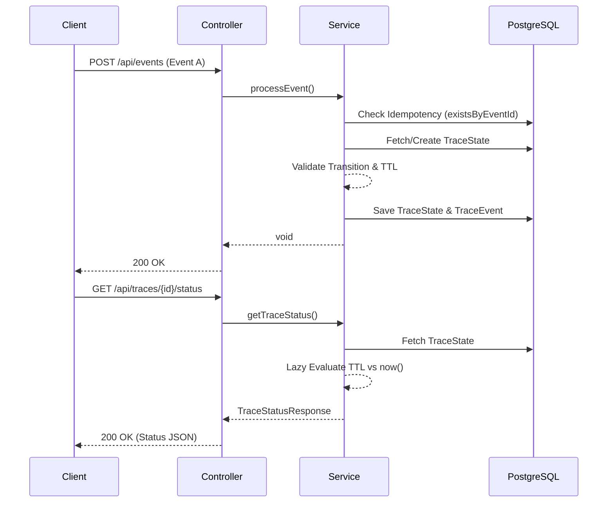

# 🏛️ Architecture & Solution Design

This document outlines the technical decisions, architecture, and quality gates implemented to solve the Clarops Engineering Challenge with a **Senior-level mindset**.

## 1. Architectural Highlights (The "Probadita")

> 💡 **Deep Dive:** For the full, comprehensive breakdown of all Architectural Decisions (ADRs), assumptions, and open questions, please read **[ARCHITECTURE_DECISIONS_EN.md](ARCHITECTURE_DECISIONS_EN.md)** *(also available in [Spanish](ARCHITECTURE_DECISIONS_ESP.md))*.

### 🛡️ Strict State Machine (The "Watchdog")
Instead of loosely accepting events, we implemented a strict `EventProcessorService` (Watchdog). If an event arrives out of order (e.g., `CARD_ISSUED` before `KYC_APPROVED`), the system immediately rejects it with a **422 Unprocessable Content**. 
*Trade-off:* In a Fintech environment, an out-of-order event is a critical inconsistency. We do not automatically retry or queue these; that is a business decision. Any recovery or DLQ logic should be handled asynchronously via an Event Broker.

### 🔄 Idempotency (200 OK)
If the exact same event ID is received again, the API silently returns a **200 OK** instead of a 409 Conflict. This makes the system naturally resilient to network retries from upstream publishers without triggering false alarms.

### ⚡ Concurrency & Optimistic Locking
We handle race conditions natively at the database level using JPA `@Version` (Optimistic Locking). If two concurrent threads attempt to process events for the same `traceId` simultaneously, the database resolves it gracefully, avoiding dirty writes and keeping the trace state pristine.

## 2. High-Level Flow



## 3. Quality Gates & Testing Strategy

Developed under strict engineering protocols: **Verification-Driven Development (VDD)**, **Principle of Least Privilege (PoLP)** for code mutations, and the **Rollback First** doctrine.

### Static Analysis & Coverage
* **Jacoco:** Enforced in the Maven pipeline to track code coverage.
* **SpotBugs:** Static analysis checks for common Java bugs and bad practices, failing the build on High/Critical issues.

### Dynamic E2E Testing with Hurl
Instead of hardcoding UUIDs and dates that cause database collisions or immediate TTL expirations when run multiple times, we wrapped our Hurl tests in Bash scripts:
* **`scripts/run-e2e-tests.sh`**: Injects `{{trace_id}}` and `{{date_now}}` dynamically.
* **`scripts/generate-load-test.sh`**: Dynamically writes 500 complete traces (1000 requests) to test database locking and concurrency under load.

## 4. API Request & Response Examples

### 1. Ingest an Event (POST `/api/events`)

**Request:**
```http
POST /api/events
Content-Type: application/json

{
  "eventId": "evt-001",
  "traceId": "trace-123",
  "eventName": "APPLICATION_RECEIVED",
  "result": "SUCCESS",
  "occurredAt": "2026-06-15T10:00:00Z",
  "nextExpectedEvent": "RULES_EVALUATED",
  "nextEventTtlSeconds": 120,
  "finalEvent": false,
  "metadata": {
    "country": "MX",
    "entityId": "company-123"
  }
}
```

**Response:**
```http
HTTP/1.1 200 OK
```

### 2. Query Trace Status (GET `/api/traces/{traceId}/status`)

**Request:**
```http
GET /api/traces/trace-123/status
```

**Response:**
```http
HTTP/1.1 200 OK
Content-Type: application/json

{
  "traceId": "trace-123",
  "status": "WAITING_OTHER_EVENT",
  "lastEventName": "APPLICATION_RECEIVED",
  "lastEventResult": "SUCCESS",
  "nextExpectedEvent": "RULES_EVALUATED",
  "nextExpectedBefore": "2026-06-15T10:02:00",
  "eventsReceived": 1,
  "updatedAt": "2026-06-15T10:00:05.123"
}
```
